# Tutorial creación app Android TV

## 0. Contenidos

1. ***[Propósito](#1.-Propósito)***
1. ***[Preparación API](#2.-Preparación-de-la-api-con-node.js)***
    1. *[Requisitos previos](#Requisitos-previos)*
    1. *[Pasos prueba inicial](#Pasos-prueba-inicial)*
    1. *[Pasos para cargar datos](#Pasos-para-cargar-datos)*
1. ***[Preparación del entorno en Android](#3.-Preparación-del-entorno-en-android)***
   1. *[Requisitos previos Android](#Requisitos-previos-android)*
   2. *[Pasos creación proyecto Android TV](#PASOS-CREACIÓN-PROYECTO-ANDROID-TV)*

## 1. Propósito

Este documento tiene el propósito de ilustrar de manera organizada la creación de una aplicación para Android TV sencilla que sirva de guía inicial para mostrar los pasos, configuraciones y problemas comunes en este tipo de desarrollo.

Se va a crear una aplicación sencilla para la plataforma Android TV que consuma videos almacenados en un servidor oropio y remoto (themoviedb.org). Adicionalmente se indicarán los pasos para conseguir emitir videos a través de un endpoint configurado con Express usando Socket.io en node.js configurado en un VPS a través de Nginx.

## 2. Preparación de la API con node.js

### REQUISITOS PREVIOS

| APLICACIÓN, BIBLIOTECA O RECURSO | USO | 
| --: | :-- |
| `npm` | Gestor de paquetes de node | 
| `node.js` | Entorno de ejecución javascript, es el motor de la API | 
| `filezilla` | (o similar) Software para transmisión de ficheros por sftp entre la máquina local y el servidor |
| `nginx` | Programa que se instalará en el VPS y que se encargará de servir la app web del streaming de video. | 
| `pm2` | Gestor de aplicaciones node que se instalará en el VPS | 
| `express` | módulo de node para crear los endpoints de la API. | 
| `body-parser` | Módulo de node a modo de middleware para extraer la información fácilmente del body como un objeto, se configurará para interceptar cada petición y poder obtener de manera transparente los datos |
| `socket.io socket.io-stream` | módulo de node para servir el streaming de video o flujos de datos de manera asíncrona, en general (No lo usaremos de momento) | 
| `Visual Studio Code` | (o similar) Editor de código para crear la aplicación web | 
| `ssh` | comando para conexión vía ssh (Secure Shell, conexión segura)  mediante el terminal o consola y acceder así a la máquina ubuntu del VPS (en mi caso particular). |

### PASOS PRUEBA INICIAL

1. Iniciación de aplicación node con `npm init` 
2. 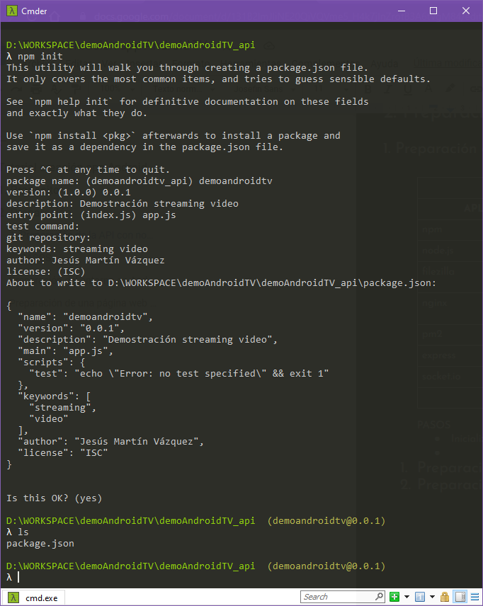
3. Necesitamos instalar Express y Socket.io, vamos a instalar estos módulos y comprobar que se añaden al fichero package.json ``npm install express --save``, ``npm install socket.io --save`` y `npm install body-parser --save` 
4. 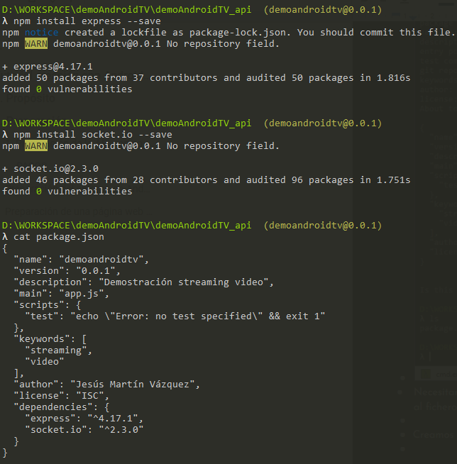
5. Creamos fichero app.js y lo editamos en Visual Studio Code
6. Creación de las variables e importación (require) de dependencias
7. 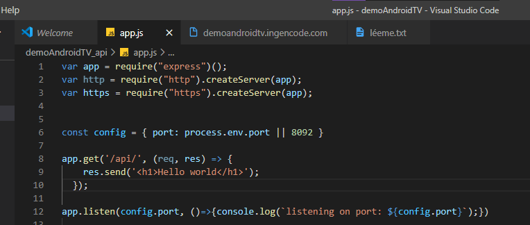
8. vamos a probar ya con este ejemplo sencillo que subiremos al servidor con Filezilla para comprobar que se lanza la aplicación. Pero antes debemos crear los directorios y configurar Nginx para que escuche en el puerto determinado:
9. Conexión al servidor VPS 
10. 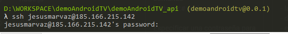
11. Creación carpeta proyecto 
12. 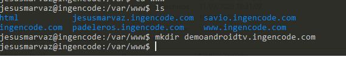
13. Voy a configurar `nginx` para mapee lo que le venga desde `demoandroidtv.ingencode.com` al puerto 8092. 
14. 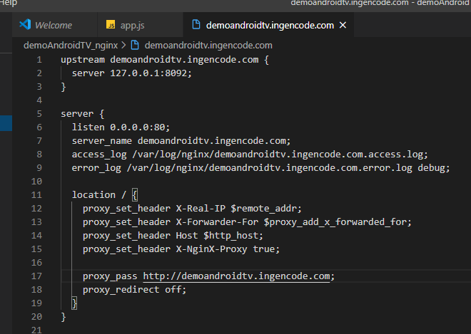
15. El siguiente paso es subir este fichero al directorio de sitios disponibles de nginx ( `/etc/nginx/sites-available/` ) : como no tengo acceso root por motivos de seguridad, debo subirlo a un directorio con permisos y desde la máquina remota y como super usuario moverlo al destino tras cambiar el propietario y grupo del fichero:
16. 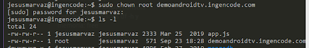
17. 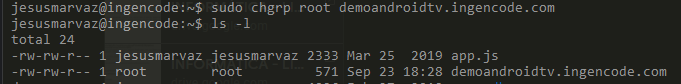
18. y ahora por fin lo movemos a su sitio en el directorio de nginx
19. 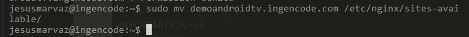
20. Ahora debemos crear un enlace simbólico en `/etc/nginx/sites-enabled`
21. 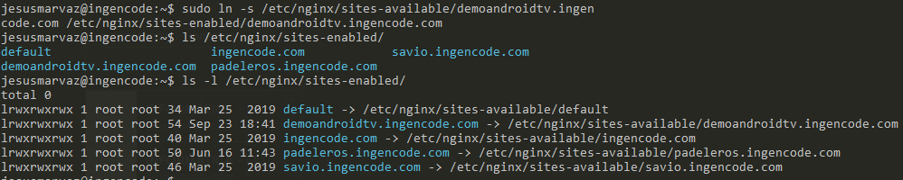
22. Es necesario reiniciar el servicio nginx con `service nginx restart` 
para que surtan los cambios.
23. En el VPS hay que crear el subdominio `demoandroidtv.ingencode.com` para que pueda funcionar la API con esa url base: 
24. 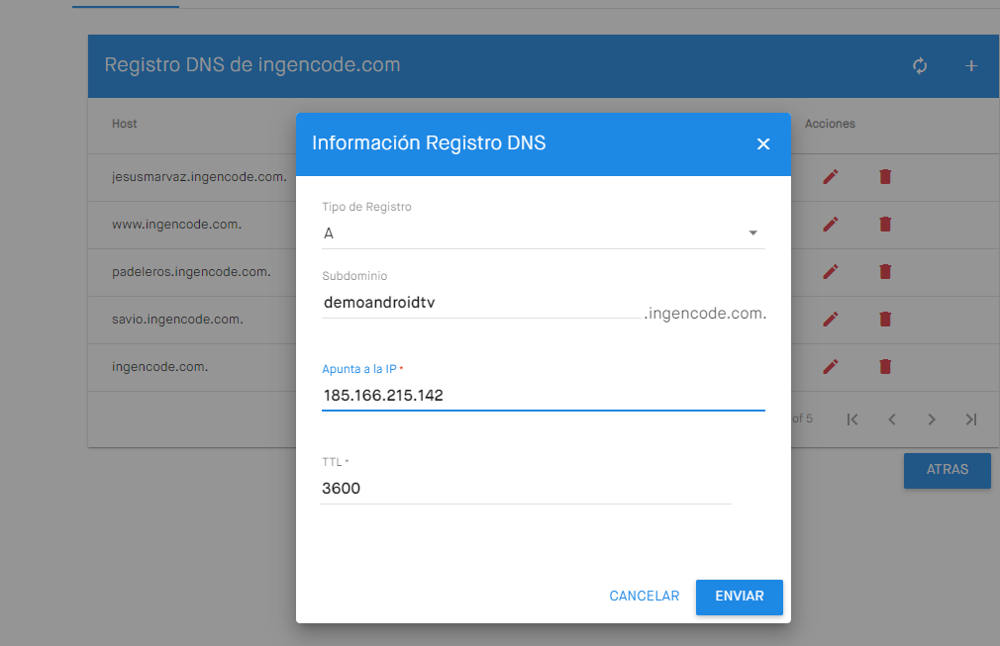
25. También debo configurar el cortafuegos para este subdominio. Y debo configurar el cortafuegos para este subdominio 
26. 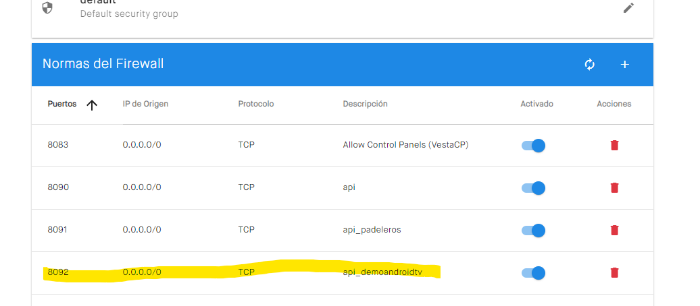
27. 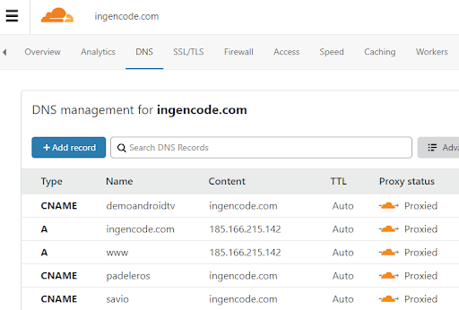
28. La propagación DNS tarda unos minutos o incluso más.
29. Después de que el subdominio esté funcionando, podemos subir la app básica que acabamos de hacer y probar que funciona para poder seguir desarrollando. La subiremos al directorio `/var/www/demoandroidtv.ingencode.com`, pero sin la carpeta `node_modules`, ya que lo instalaremos con `npm install`. 
30. 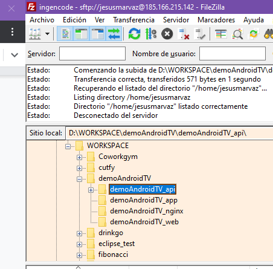 
31. 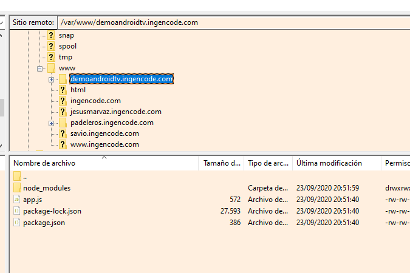
32. El siguiente paso es lanzar la app mediante pm2 (tras habernos conectado vía consola y ssh con el servidor) 
33. 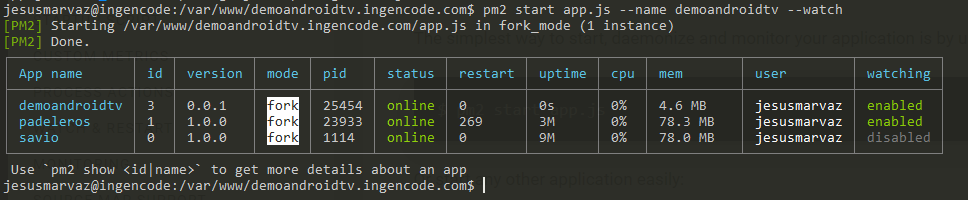
34. con la opción `--name` damos un nombre al proceso o app, y con `--watch` hacemos que cualquier cambio en los ficheros haga reiniciar la app.
35. Ahora con `pm2 logs` demoandroidtv podremos visualizar estado, errores y logs de la app creada en tiempo real para hacer debug o controlar su estado. Cada vez que suba un cambio, con `--watch`, hará reiniciar la app. 
36. 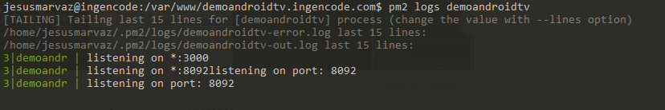
37. Ya podemos probar desde un navegador o desde postman, por ejemplo,  accedo a `https://demoandriodtv.ingencode.com/api/` 
38.  
39. 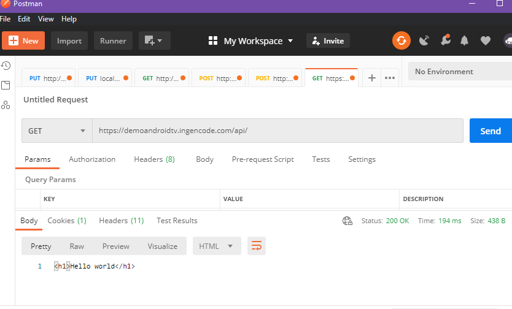

### PASOS PARA CARGAR DATOS

1. Añadimos una ruta que describiremos en un fichero distinto, para tener buenas prácticas si vamos escalando y tener todo más organizado

1. Se define un directorio estático, que partirá de `html` y albergará la subcarpeta `media` donde se guardarán los ficheros de video y un `json` con los metadatos.
1. Definimos cabeceras de respuesta a modo de middleware previo a cada respuesta del servidor
2. 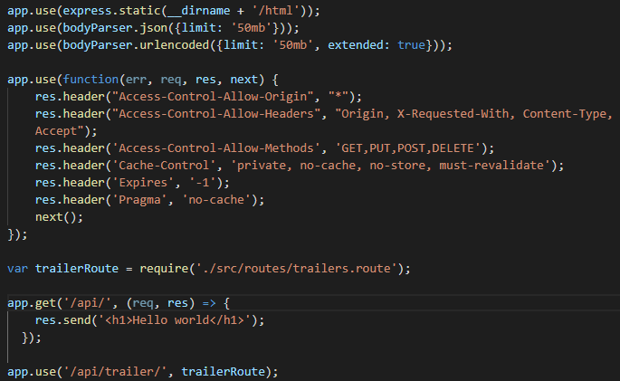
3. el fichero de la ruta,  `trailers.route.js`, contendrá el método get para arrojar los datos 
4. 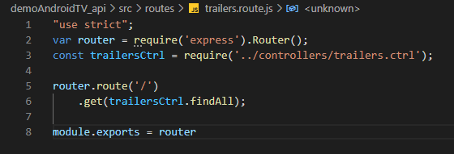
5. y finalmente el controlador contendrá la sencilla lógica de esta demo para por ejemplo el endpoint GET($ruta_base/api/trailer). 
6. 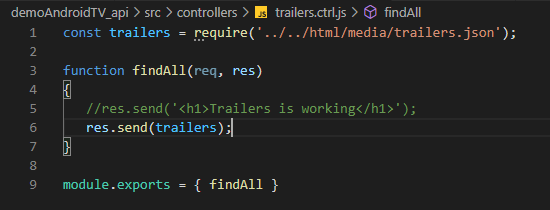
7. En el fichero json podremos guardar metadatos 
8. 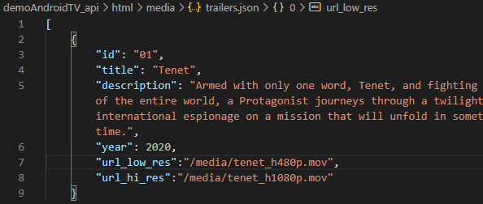
9. Probamos el endpint GET($ruta_base/api/trailer) con postman 
10. 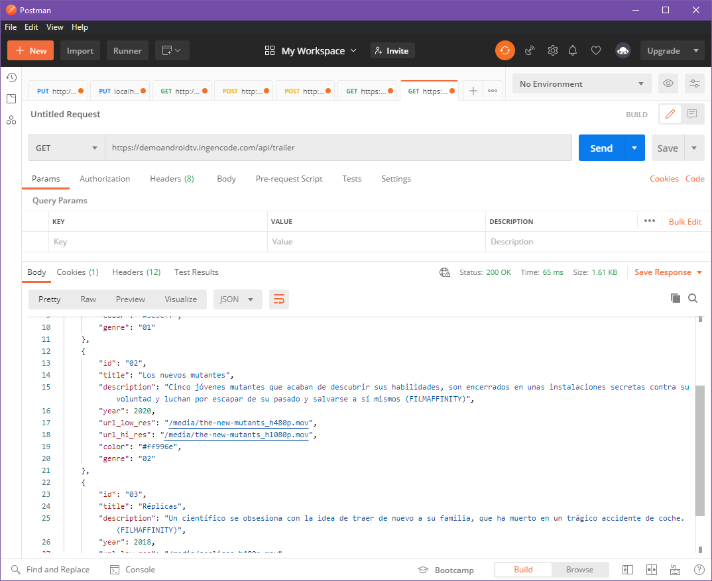
11. Y finalmente consumimos el video con VLC, por ejemplo 
12. 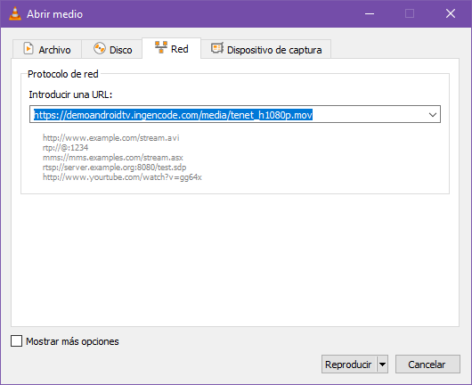
13. 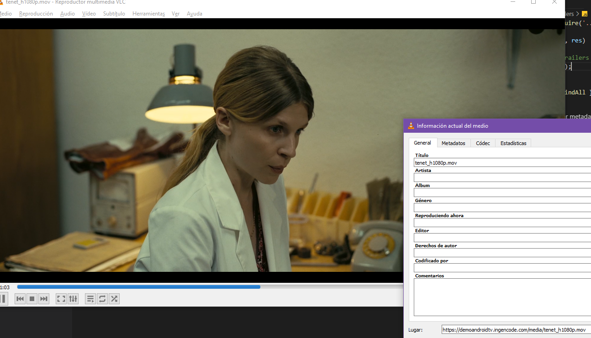

Ya tenemos todo listo desde la parte de backend para servir videos desde nuestro propio servidor, ahora toca crear el proyecto de AndroidTV.


## 3. Preparación del entorno en Android

### REQUISITOS PREVIOS ANDROID

| APLICACIÓN, BIBLIOTECA O RECURSO | USO | 
| --: | :-- |
| `Android Studio` | El IDE de Google para desarrollos Android, es el entorno de desarrollo oficial | 
| `emulador TV` | Debido a que no tengo la suerte de disponer de una TV Android debo optar por esta solución para realizar las pruebas |
| `WireframeSketcher` | Software para creación de bocetos de la UI de la aplicación (o similar) | 
| `LeanBack` | Biblioteca que proporciona funcionalidad estándar para casos de uso comunes en aplicaciones de TV | 
| `Gimp` | software gratuito de edición de imágenes para crear o editar recursos gráficos que necesitemos para la aplicación |
| `retrofit` | librería para consumir datos de una APIREST remota fácilmente y poder deserializar cómodamente las respuestas en objetos locales |
| `RxJava` | Con esta librería manerajemos los flujos de datos asíncronos, en combinación con `Retrofit`|
| `OkHttp:Logging-interceptor` | Lo usaremos a modo de interceptor en las comunicaciones REST, a modo de log |
| `Picasso` / `Glide` | Carga de imágenes |

---

**Documentación oficial [aquí](https://developer.android.com/training/tv/start/start?hl=es)**

---

### PASOS CREACIÓN PROYECTO ANDROID TV


- Creación de un nuevo proyecto, voy en principio a usar compatibilidad máxima

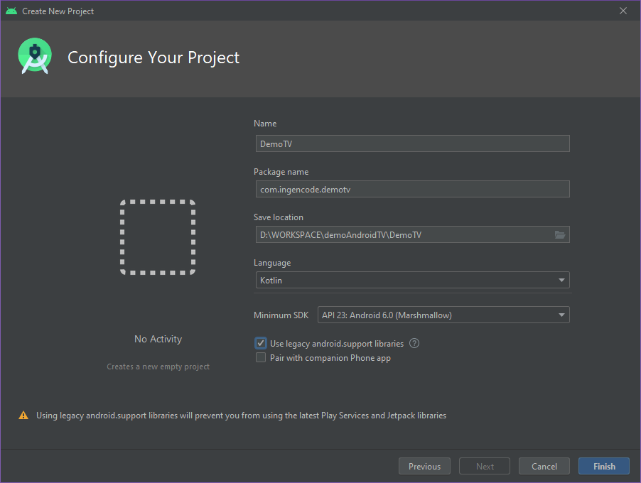

### Migración a AndroidX

Para ofrecer la máxima compatibilidad con versiones anteriores de la API del SDK de Android, lo recomentable es dejar las antiguas versiones de las librerías de compatibilidad y usar las librerías de `AndroidX`. Hemos de migrar el proyecto a este entorno antes de empezar a trabajar:

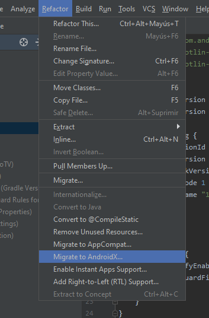

- Las restricciones iniciales para poder trabajar con AndroidTV son 
    1. Tener actualizado Android Studio es suficiente para asegurar la última versión del SDK (min 24.0.0) 
       - *File/Settings/Appareance and behavior/Updates*
    1. uso de SDK Android 5.0 (API 21) o superior

### **Configuración común en AndroidManifest.xml** 

- **LEANBACK** Es recomendable el uso del tema *Leanback* para brindar compatilidad con dicha librería, que será el estándar en la aplicación que creemos por la fácil integración de componentes compatibles con un uso estándar de navegación en interfaces de TV. Además, las clases de esa librería están pensadas para ser extendidas, es decir heredar de ellas y personalizarlas. Además es obligatorio el uso del `intent-filter` con LEANBACK_LAUNCHER:
> ```
> <activity
>        android:name="com.example.android.TvActivity"
>        android:label="@string/app_name"
>        android:theme="@style/Theme.Leanback">
>        <intent-filter>
>          <action android:name="android.intent.action.MAIN" />
>          <category android:name="android.intent.category.LEANBACK_LAUNCHER" />
>        </intent-filter>
></activity>
> ```

La aplicación de TV puede declararse como exclusiva para TV que utilice la librería UI de Leanback desde el archivo de manifiesto, `AndroidManifest.xml`, pero hará que solo se reproduzca en TV, puede ser útil para restringir el uso accidental de la aplicación en tablets u otros dispositivos si no es el *target* de uso. Esto además hará que se muestre correctamente en la tienda (Google Play Store) como aplicación para TV.

> ```   
> <manifest>
>        <uses-feature android:name="android.software.leanback"
>            android:required="true" />
>        ...
> </manifest>

Por último, en el fichero **build.gradle** de la aplicación, podemos observar y editar las dependencias para ir incorporando las librerías que necesitamos, al crear el proyecto para TV se añade automáticamente la librería de soporte de Leanback:

> ```
> dependencies {
>    implementation fileTree(dir: "libs", include: ["*.jar"])
>    implementation "org.jetbrains.kotlin:kotlin-stdlib:$kotlin_version"
>    implementation 'androidx.leanback:leanback:1.0.0'
> }


- **BANNER** El banner puede definirse a nivel `application` o a nivel `activity` y se configura con un fichero _drawable_ que debe tener unas dimensiones de 320 × 180 px y además debe contener texto. Esto hace que si nuestra aplicación está en varios idiomas tengamos que crear distintas versiones del drawable según el idioma.

> ```
> <application
>    android:banner="@drawable/banner" >
>     ...

Existen dos estrategias para lograr crear el banner:

1. Creación manual de un recurso de 320 x 180px con un texto integrado
   - Uso de Gimp para crear un ejemplo de banner
   - 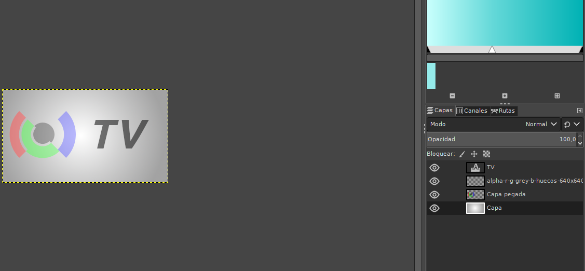
   - 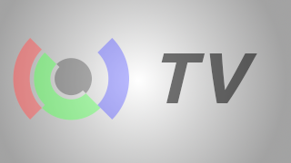

2. Uso de la herramienta para creación de banner de TV de Android Studio
   - Creación de un logo 
   - 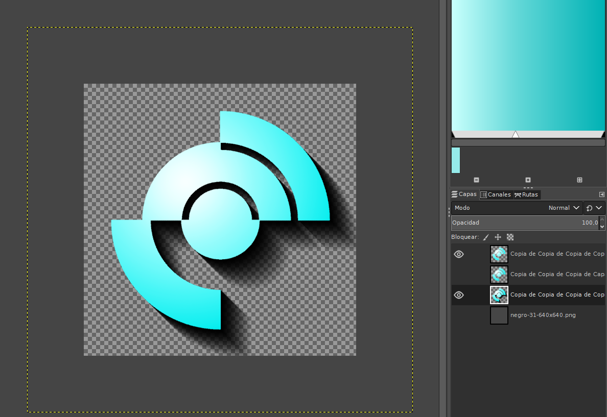
   - Uso de la herramienta de creación de banner de Android Studio, para dar forma e integrar texto y fondo
   - 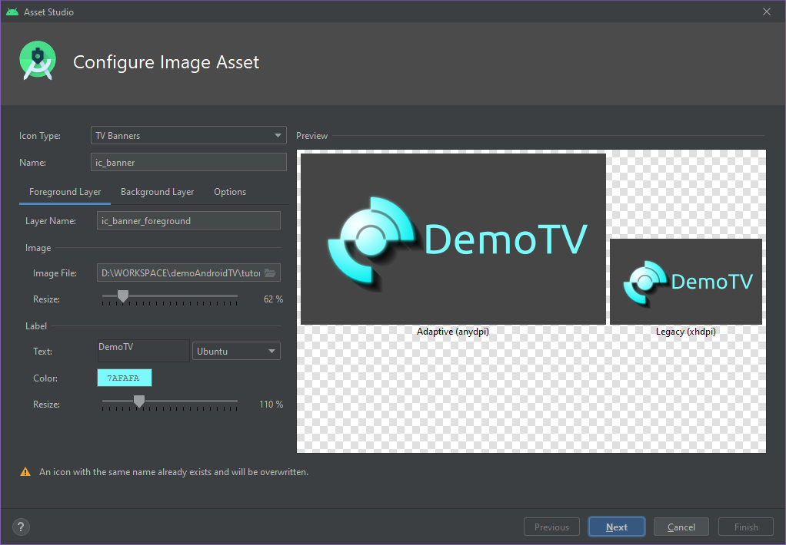
   - 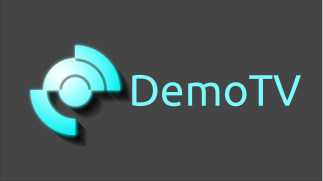


El desarrollo de una aplicación para ejecutarse en una TV difiere notablemente de la de dispositivos como móviles o tabletas en lo que a hardware y controles se refiere por motivos obvios. Una de las principales diferencias es que la pantalla de una TV no es táctil, no tiene sentido en un uso a unos 3 metros de distancia. La aplicación para TV debe ser compatible con un PAD con controles direccionales, selección, atrás e inicio. Por ello es **OBLIGATORIO** definir explítamente que no dispone de control táctil el dispotivo objetivo (TV):

> ```
> <manifest>
>   <uses-feature   android:name="android.hardware.touchscreen"
>                   android:required="false"/>
> ...
> </manifest>

**EVENTOS del PAD de control de la TV a manejar**

[documentación oficial controles ](https://developer.android.com/training/tv/start/controllers)

| KeyEvent | Comportamiento |
| -- | -- |
| BUTTON_B, BACK |	Atrás |
| BUTTON_SELECT, BUTTON_A, ENTER, DPAD_CENTER, KEYCODE_NUMPAD_ENTER	| Selección |
| DPAD_UP, DPAD_DOWN, DPAD_LEFT, DPAD_RIGHT | Navegación |

---
### **Boceto de la aplicación**

A continuación se muestra un boceto o sketch de la idea general de la apariencia que tendrá la aplicación que queremos construir:

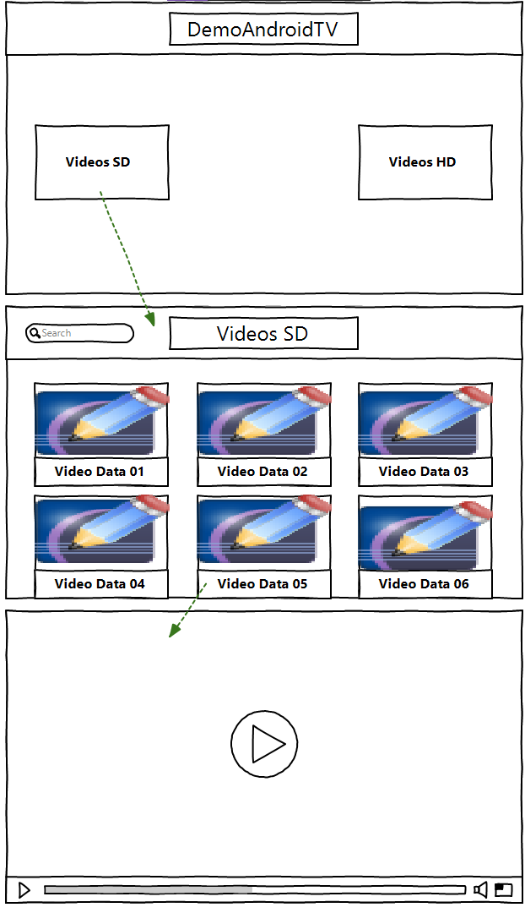


### Creación de actividad

Como hemos creado un proyecto sin plantilla, ni siquiera ofrece una actividad inicial, por lo que va a ser necesario crear todo desde 0, lo que puede venir bien para ilustrar cada paso de la creación de la aplicación. En primer lugar voy a crear un paquete llamada `ui` para albergar ahí las actividades y fragmentos.

Antes de la edición de la actividad principal, veamos cómo queda el fichero de AndroidManifest.xml, integrando lo indicado anteriormente:

> ```
> <?xml version="1.0" encoding="utf-8"?>
><manifest xmlns:android="http://schemas.android.com/apk/res/android"
>    package="com.ingencode.demotv">
>     <uses-permission android:name="android.permission.INTERNET" />
>     <uses-feature
>        android:name="android.software.leanback"
>        android:required="true" />
>     <uses-feature
>        android:name="android.hardware.touchscreen"
>        android:required="false" />
>  
>     <application
>        android:allowBackup="true"
>        android:icon="@mipmap/ic_launcher"
>        android:label="@string/app_name"
>        android:supportsRtl="true"
>        android:theme="@style/Theme.Leanback"
>        android:banner="@mipmap/ic_banner">
>        <activity android:name=".ui.MainActivity"
>              android:configChanges="keyboard|keyboardHidden|navigation">
>            <intent-filter>
>                <action android:name="android.intent.action.MAIN" />
>                <category android:name="android.intent.category.LEANBACK_LAUNCHER" />
>            </intent-filter>
>        </activity>
>     </application>
></manifest>

Y la apariencia en el menú de aplicaciones, gracias a la creación del banner es la siguiente:

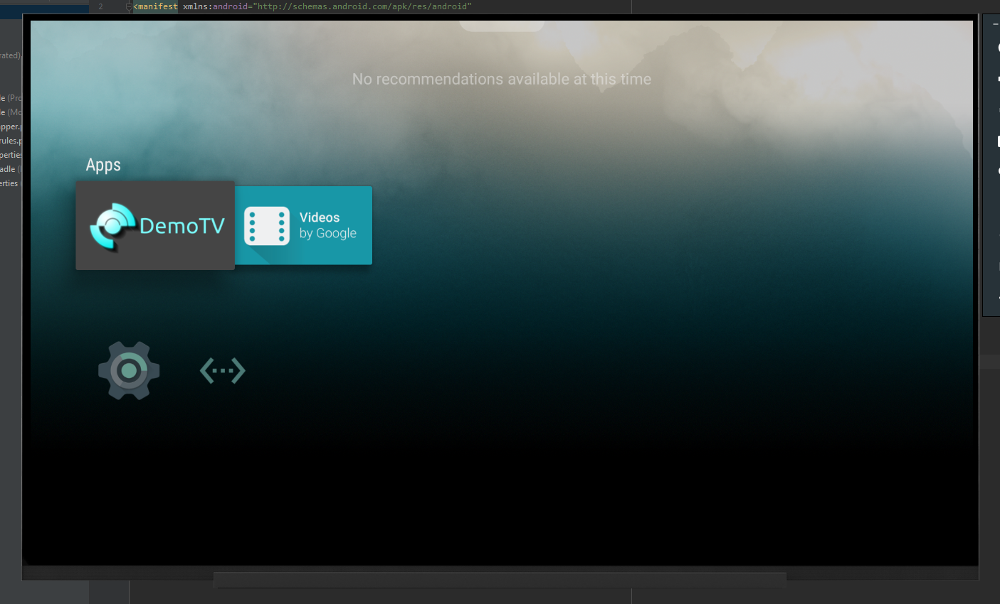

### Creción del fragmento de reproducción

En esta parte se configurará el fragmento de reproducción de la biblioteca `Leanback`, para ello debemos importar los siguientes componentes:
>```
> import androidx.leanback.app.VideoSupportFragment
> import androidx.leanback.app.VideoSupportFragmentGlueHost
> import androidx.leanback.media.MediaPlayerAdapter
> import androidx.leanback.media.PlaybackGlue
> import androidx.leanback.media.PlaybackTransportControlGlue

Pero antes debemos crear el POJO y DTO que contendrá la información relativa al video, es decir debemos estructurar los datos del video usando una `data class` de Kotlin por cada elemento, el POJO corresponderá al objeto *local* mientras que el DTO corresponde al *Data Transfer Object* que viene desde la API, es importante separar la información:

> ```
> data class VideoInfoDto
>     (
>         val id:String? = null,
>         val title:String? = null,
>         val description:String? = null,
>         val year: Int? = null,
>         val url_low_res: String? = null,
>         val url_hi_red: String? = null,
>         val background:String? = null,
>         val genre:String? = null
>     ) : Dto, Serializable
> 
> data class VideoInfoPojo
>     (
>         val id:String?,
>         val title:String?,
>         val description:String?,
>         val year:Int?,
>         val urlLowRes:String?,
>         val urlHiRes:String?,
>         val background:String?,
>         val genre:String?
> 
> ) : Serializable, Pojo

Para trabajar con el objeto local debemos *mapearlo* desde el objeto DTO, para ello voy a definir unas interfaces que harán a modo de contrato con cada mapper:

> ```
> interface Dto
> interface Pojo
> 
> interface MapperToDto
> {
>     fun getMapperToDto() : (Pojo) -> Dto
> }
> 
> interface MapperToPojo
> {
>     fun getMapperToPojo() : (Dto) -> Pojo
> }

Y el mapeador concreto será:

> ```
> object VideoMapper : MapperToDto, MapperToPojo
> {
>     private fun mapToDto(pojo: Pojo): Dto
>     {
>         with(pojo as VideoInfoPojo)
>         {
>             return VideoInfoDto(pojo.id, pojo.title, pojo.description, pojo.year, pojo.urlLowRes,
>             pojo.urlHiRes,  pojo.background, pojo.genre)    
>         }        
>     }
> 
>     private fun mapToPojo(dto: Dto): Pojo
>     {
>         with(dto as VideoInfoDto)
>         {
>             return VideoInfoPojo(dto.id, dto.title, dto.description, dto.year, Routes.BASE_URL + dto.url_low_res,
>                 Routes.BASE_URL + dto.url_hi_res, Routes.BASE_URL + dto.background, dto.genre)
>         }
>     }
>     override fun getMapperToDto(): (Pojo) -> Dto = VideoMapper::mapToDto
>     override fun getMapperToPojo(): (Dto) -> Pojo = VideoMapper::mapToPojo
> }

Ahora ya podemos crear el fragmento de reproducción a partir de Leanback:

> ```
> class VideoPlayerFragment : VideoSupportFragment()
> {
>     private lateinit var video: VideoInfoPojo
>     companion object { val TAG = "VideoConsumption" }
>     
>     fun setVideo(video: VideoInfoPojo) { this.video = video }
> 
>     override fun onResume()
>     {
>         super.onResume()
>         val playerGlue = PlaybackTransportControlGlue(getActivity(),
>             MediaPlayerAdapter(getActivity())
>         )
>         playerGlue.setHost(VideoSupportFragmentGlueHost(this))
>         playerGlue.addPlayerCallback(object : PlaybackGlue.PlayerCallback() {
>             override fun onPreparedStateChanged(glue: PlaybackGlue) {
>                 if (glue.isPrepared()) {
>                     //playerGlue.seekProvider = MySeekProvider()
>                     playerGlue.play()
>                 }
>             }
>         })
>         playerGlue.setSubtitle(video.title)
>         playerGlue.setTitle(video.description)
>         playerGlue.getPlayerAdapter().setDataSource(Uri.parse(video.urlHiRes ?: video.urlLowRes))
>     }
> }

Este fragmento contiene los controles de reproducción estilo moderno, gracias a la clase helper `PlaybackTransportControlGlue`:

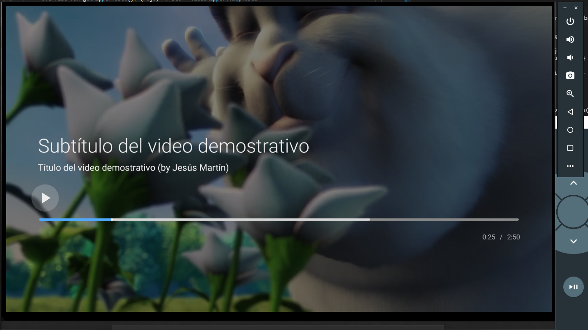

### Conexión con API

Hasta ahora hemos hemos trabajado con datos mockeados o generados de manera local, pero lo ideal es tabajar online. En esta parte vamos, por tanto, a utilizar las librerías Retrofit, RxJava y OKHttp3 para trabajar con la parte de consumición del servicio API. Para ellos crearemos un paquete llamado `common` y dentro de este guardaremos otro paquete llamado `api`:

Trabajaremos en estas clases, objetos e interfaces:

- Archivo de los endpoints y rutas url, será un objeto, singleton: `Routes`

> ```
> object Routes
> {
>     const val BASE_URL = "https://demoandroidtv.ingencode.com"
>     const val API = "/api/"
>     const val BASE_URL_API = "$BASE_URL$API"
>     const val URL_VIDEO_INTRO = "$BASE_URL/media/sample720.mp4"
>     const val EP_TRAILERS = "videodata/videos"
> }

- Archivo de definición de llamadas abstractas a la API, será una interfaz: `RetrofitApi`

> ```
> interface RetrofitApi
> {
>     @GET(Routes.EP_VIDEOS)
>    fun getVideos() : Single<List<VideoInfoDto>>
> }


- Archivo de implementación y configuración de retrofit, será una clase: `ServiceOfApi`, en este archivo se configura el serializador por defecto, la ruta base de las llamadas rest, el logger a modo de interceptor con okHttp, el adaptador de la llamada rest y se construye a partir de la interfaz definida anteriormente `RetrofitApi`, retrofit sabrá cuales y cómo ha de configurar los endpoints

> ```
> class ServiceOfApi
> {
>     val apiClient: RetrofitApi
>     init
>     {
>         val gson = GsonBuilder()
>             //.registerTypeAdapter(Type::class.java, TypeDeserializer())
>             .create()
>         val apiClientConfig = Retrofit.Builder()
>             .baseUrl(Routes.BASE_URL_API)
>             .addConverterFactory(GsonConverterFactory.create(gson))
>             .addCallAdapterFactory(RxJava2CallAdapterFactory.create())
>         setupConfig(apiClientConfig)
>         apiClient = apiClientConfig.build().create(RetrofitApi::class.java)
>     }
> 
>     private fun setupConfig(builder: Retrofit.Builder)
>     {
>         val logging = HttpLoggingInterceptor().apply { level = HttpLoggingInterceptor.Level.BODY }
> 
>         val okHttpClient = OkHttpClient.Builder()
>             .addInterceptor(logging)
>             .build()
>         builder.client(okHttpClient)
>     }
> }


- Archivo de implementación de llamadas concretas a la api, será un objeto singleton: `Api`:

> ```
> object Api
> {
>     private val apiService = ServiceOfApi()
>     private val gson = Gson()
> 
>     fun getTrailers() : Single<List<VideoInfoDto>>
>     {
>         return apiService.apiClient.getVideos()
>             .observeOn(AndroidSchedulers.mainThread())
>             .subscribeOn(Schedulers.io())
>     }
> }

### Creación de un Grid para mostrar los videos

Ahora vamos a hacer uso de la clase `VerticalSupportGridFragment` para organizar un set de videos recuperados de nuestra API. 

**NOTA**: *Hay que añadir un campo más a la información de los videos, será un campo url_background y contendrá la uri de la imagen de fondo de la tarjeta resumen del video, será una imagen jpg de 1280 x 720 px : (fichero de la API, videos.json)*

> ```
> [
>    {
>        "id": "01",
>        "title": "Sample tierra",
>        "description": "Tierra girando",
>        "year": 2019,
>        "url_low_res":"/media/sample1080.mp4",
>        "url_hi_res":"/media/sample1080.mp4",
>        "url_background": "/media/sample1080_background.jpg",
>        "genre": "01"
>    }, 
> 
>  ...
> 
> ]

En ssta parte hay mucho código y se hace tediosa, voy a hacer un resumen de lo necesario:
- Creación de una implementación de `androidx.leanback.widget.Presenter` llamada para este ejemplo `CardPresenter`. En esta clase se definirá el tamaño, lo métodos de relleno de datos (modelo `VideoInfoPojo`), etc
- Creación del Fragmento que se cargará en la actividad y contendrá la lógica de la vista, va a implementar la interfaz `View` del modelo MVP que tendrá esta estructura:

> ```
> interface IGrid
> {
>     interface View
>     {
>         fun updateUI(list:ArrayList<VideoInfoPojo>)
>         fun showError()
>     }
> 
>     interface Presenter : IHasCompositeDisposable
>     {
>         fun tryGetVideos()
>         fun onVideosFetched(list: ArrayList<VideoInfoPojo>)
>         fun onError()
>     }
> 
>     interface Model
>     {
>         fun getVideos() : Single<ArrayList<VideoInfoPojo>>
>     }
> }

- Al modelo se le injectará la implementación de una interfaz del proveedor de datos, debemos depender de abstracciones y no de implementaciones concretas, siguiendo principios S.O.L.I.D., y así se ha hecho en este ejemplo:
 
> ```
> interface IGridProvider
> {
>    fun getVideos() : Single<ArrayList<VideoInfoPojo>>
>}

y su implementación:

> ```
> class GridProvider : IGridProvider
> {
>     override fun getVideos(): Single<ArrayList<VideoInfoPojo>>
>     {
>         return Api.getVideos().map { videos ->
>             val arrayList = arrayListOf<VideoInfoPojo>()
>             arrayList.addAll(videos.map { video -> VideoMapper.getMapperToPojo().invoke(video) as  VideoInfoPojo })
>             arrayList
>         }
>     }
> }

Model:

> ```
> class Model(private val pr: IGridProvider) : IGrid.Model
> {
>     override fun getVideos(): Single<ArrayList<VideoInfoPojo>>
>     {
>         return pr.getVideos()
>     }
> }


- El presentador:

> ```
> class Presenter(private val v: IGrid.View, private val m: IGrid.Model) : IGrid.Presenter, > IHasCompositeDisposable by hasCompositeDisposable()
> {
>     override fun onError()
>     {
>         v.showError()
>     }
> 
>     override fun onVideosFetched(list: ArrayList<VideoInfoPojo>)
>     {
>         v.updateUI(list)
>     }
> 
>     override fun tryGetVideos()
>     {
>         addDisposable(m.getVideos().subscribe(
>             {
>                 onVideosFetched(it)
>             },{
>                 onError()
>             }))
>     }
> }

La parte de unir la información con la vista, generando la disposición en grid, fragmento `DemoVerticalFragment`, método `UpdateUI()` (nota que he repetido los videos para generar 12 elementos de manera rápida):

> ```
> class DemoVerticalGridFragment : VerticalGridSupportFragment(), IGrid.View,
>     OnItemViewSelectedListener, OnItemViewClickedListener
> {
>     private lateinit var p: IGrid.Presenter
>     private lateinit var arrayObjectAdapter: ArrayObjectAdapter
>     private val COLUMNS = 4
> 
>     override fun onCreate(savedInstanceState: Bundle?)
>     {
>         super.onCreate(savedInstanceState)
>         p = Presenter(this, Model(GridProvider()))
>         setupElements()
>     }
> 
>     override fun onDestroy()
>     {
>         p.dispose()
>         super.onDestroy()
>     }
> 
>     private fun setupElements()
>     {
>         val videoGridPresenter = VerticalGridPresenter(FocusHighlight.ZOOM_FACTOR_MEDIUM)
>         videoGridPresenter.numberOfColumns = COLUMNS
>         setOnItemViewSelectedListener(this)
>         onItemViewClickedListener = this
>         gridPresenter = videoGridPresenter
> 
>         arrayObjectAdapter = ArrayObjectAdapter(CardPresenter())
>         adapter = arrayObjectAdapter
>         prepareEntranceTransition()
>     }
> 
>     override fun onResume()
>     {
>         super.onResume()
>         p.tryGetVideos()
>     }
> 
>     override fun updateUI(list: ArrayList<VideoInfoPojo>)
>     {
>         arrayObjectAdapter.clear()
>         arrayObjectAdapter.addAll(arrayObjectAdapter.size(), list)
>         arrayObjectAdapter.addAll(arrayObjectAdapter.size(), list)
>         arrayObjectAdapter.addAll(arrayObjectAdapter.size(), list)
>         arrayObjectAdapter.addAll(arrayObjectAdapter.size(), list)
>         startEntranceTransition()
>     }
> 
>     override fun showError() = Toast.makeText(
>         context,
>         R.string.error_getting_videos,
>         Toast.LENGTH_LONG
>     )
>         .show()
> 
>     override fun onItemClicked(
>         itemViewHolder: androidx.leanback.widget.Presenter.ViewHolder?,
>         item: Any?,
>         rowViewHolder: RowPresenter.ViewHolder?,
>         row: Row?
>     )
>     {
>         if(item is VideoInfoPojo)
>         {
>             val i = Intent(activity, VideoPlayerActivity::class.java)
>             i.putExtra(VideoPlayerFragment.TAG, item)
>             startActivity(i)
>         }
>     }
> 
>     override fun onItemSelected(
>         itemViewHolder: androidx.leanback.widget.Presenter.ViewHolder?,
>         item: Any?,
>         rowViewHolder: RowPresenter.ViewHolder?,
>         row: Row?
>     ) {}
> 
> }

Y el resultado de esta parte lo obtenemos aquí:

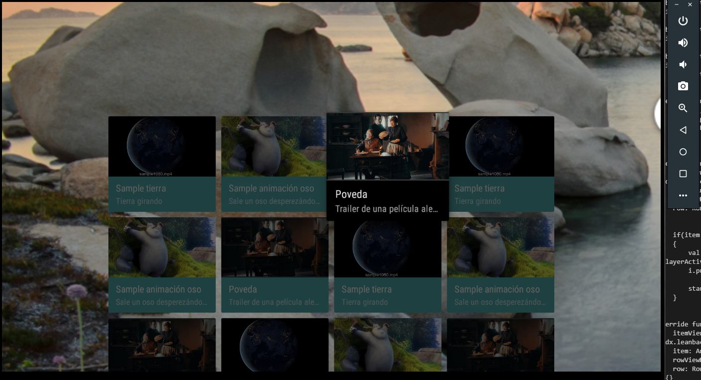

